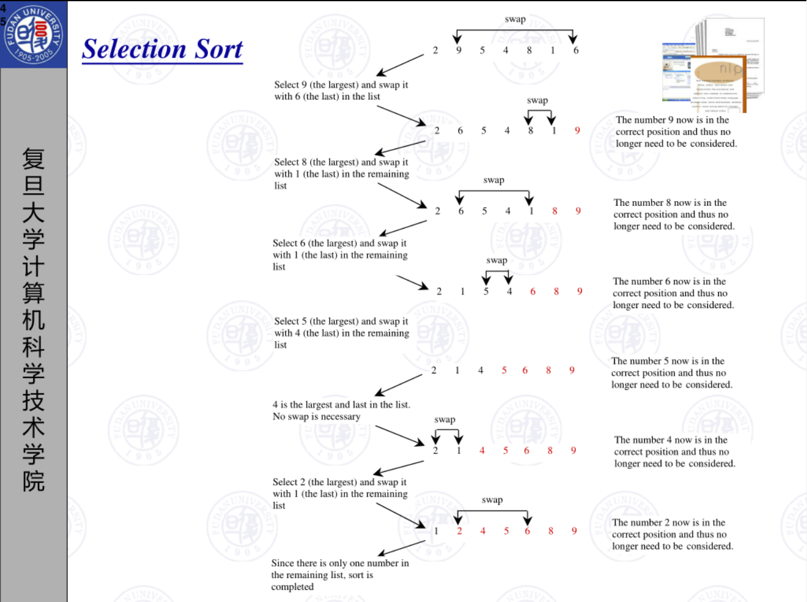

# lab10

>本节目标：
>
>1. 学习使用函数。
>2. 巩固练习数组的使用。
>3. PJ拆解。

获取及提交lab
-------
获取：通过 https://github.com/C-FUDAN-2020/lab10 获取。

提交物：将你完成思考题的文档，编程题的代码作为 lab7 的提交物。

提交：需要提交一个文档（命名为文档），两个源程序（分别命名为c1和c2，c1对应求方差，c2对应PJ拆解），提交至超星学习通对应的作业题目中。

截止时间：北京时间 2020年11月29日 23:59:59

## 函数知识（可跳过）

在C语言中，函数是能够完成独立功能的程序段。函数的正确使用可以提高代码的可读性，减少代码冗余。使用函数封装不同的功能模块对于程序的测试、调试也大有裨益。

#### 1 函数的定义

函数定义需要指明内容：函数返回值类型，函数名，函数的形参和函数体。在函数体内可以定义函数专用的变量以及实现函数功能的语句序列。函数定义的一般形式为：

```c
类型符 标识符（形式参数说明表） <---- 这三部分合称为函数头
{
   说明合定义部分     <---- 函数体
   语句序列
}

```
##### 1.1 类型符

类型符是函数返回值的类型，如果函数没有返回值，类型符为void。

##### 1.2 标识符

标识符是函数的名称，除一个C程序中必须有且只有一个main()主函数外，其他函数在满足标识符的基础上可以随意命名。
一个命名良好的函数可以通过名称告诉使用者程序的功能。常见命名法有：驼峰法（第一个单词小写，其他单词首字母大写，如loadFile(char*, void*)），
帕斯卡命名法（每个单词首字母大写，如DisplayInfo()、GetUsername()），下划线法（每一个单词都小写，中间下划线分割，
如print_tips()、create_empty_grid()）。

##### 1.3 形式参数说明列表

使用函数有时需要向函数中传入数据，形式参数就是传入数据的接口。它的一般形式如 `类型符 形参1, 类型符 形参2, 类型符 形参3, ..., 类型符 形参n`。
如果函数没有形参，可以`类型符 标识符()`或`类型符 标识符(void)`。相对于函数体，形式参数可以看作已经定义的变量，函数体中可以直接使用。

下面都是定义良好的的函数：
```c
/**
  * 返回类型是 double
  * 函数名是 min
  * 形式参数有两个 x, y
  */
double min(double x, double y){
  // 返回数据
  return x < y ? x : y;
}

/**
  * 返回类型是 void （函数没有返回值，不代表没有 return 语句）
  * 函数名是 print_tips
  * 没有形式参数
  */
void print_tips() {
    printf("\t[\\h]\t打印命令提示\n");
    printf("\t[\\p]\t打印当前地图\n");
    printf("\t[\\l <filename>]\t导入地图\n");
    printf("\t[\\s <filename>]\t保存地图\n");
    printf("\t[\\d]\t进入地图设计模式\n");
    printf("\t[\\q]\t退出地图设计模式\n");
    printf("\t[\\g]\t生成下一代生命\n");
    printf("\t[\\r]\t开始生命游戏\n");
    printf("\t[\\e]\t停止生命游戏\n");
    printf("\t[end]\t退出游戏\n");
}
```

#### 2 函数的调用

函数定义后，凡要完成函数功能的地方，可用函数调用实现。

##### 2.1 函数调用的一般形式

函数调用的一般形式为 `标识符(实在参数表)` 或 `标识符()`。它们分别对应有无形式参数的函数。函数调用时，实参与函数定义的形参一一对应，类型一致。实参可以是常量、变量、表达式等。调用时，
实参向对应位置的形参传递数据。
  
##### 2.2 函数调用的方法

- 函数调用作为独立的语句

  如果函数调用只是利用函数所完成的功能，不关心函数的返回结果（函数可能有返回结果）。那么函数调用可以作为独立的语句。如
  ```c
  // 实际上函数scanf和printf都具有返回值
  int N;
  scanf("%d", &N);
  printf("%d",N * 4 + 2);
  ```

- 函数调用出现在表达式中

  这种情况表示会利用函数的返回值进行下一步的操作。如
  ```c
  void getMinValue(){
     double a, b,c;
     // 使用scanf的返回值
     if(scanf("%lf %lf %lf",&a,&b,&c)<3){
         printf("Input error!");
         // return; 表示函数没有返回值，并且提前结束函数运行。
         return;
     }
     // 使用min的返回值
     double minValue = min(a,min(b,c));
     peintf("%lf",minValue);
  }
  ```
##### 2.3 函数调用执行过程（重要）
一般6个步骤：
1. 为函数的形式参数分配内存。
2. 计算实参表达式的值，并将实参表达式的值赋给对应的形参。
3. 为函数的局部变量分配内存空间。
4. 执行函数体内的语句序列。
5. 函数体执行完，或执行了函数体内的return语句（如果return是表达式，计算后作为函数返回值），释放这次函数调用分配的全部内存空间（一般不会清零）。
6. 将函数返回值（如果有）作为函数调用的结果，从函数调用处继续执行。

##### 2.3 函数值传递（重要）
C语言规定，实参对形参的数据传递是"值传递"，即单向传递。如果实参也是变量，则实参和形参是不同的变量。程序示例如下：
```c
#include <stdio.h>
void func(int x, int y){
   x += 10;
   y += 10;
   printf("In func, formal parameters x=%d, y=%d.\n",x,y);
}
int main(){
   int x=5,y=8;
   printf("In main, initial value x=%d, y=%d.\n",x,y);
   func(x,y);
   printf("In main, After calling the function, real parameters x=%d, y=%d.\n",x,y);
   return 0;
}
/**
  * 程序运行结果
  * In main, initial value x=5, y=8.
  * In func, formal parameters x=15, y=18.
  * In main, After calling the function, real parameters x=5, y=8.
  */
```

## 编程题

#### 编写函数对数组进行选择排序
编写一个函数，传入整数数组和数组长度，利用选择排序算法进行排序，要求从小到大排列。助教已经给出部分代码（sort1.c），同学们进行补全（可以修改已有代码，但不能修改函数头）。
选择排序算法可以查看数组章节PPT，页数46-49。如下是算法过程截图：


#### 编写递归函数进行归并排序
编写一个函数，传入整数数组和数组长度，利用归并排序算法进行排序，要求使用递归并且数组从小到大排列。
助教已经给出部分代码（sort2.c），同学们进行补全（可以修改已有代码，但不能修改函数头）。如下是归并排序算法思想：

- 归并排序是一种非常重要的分治思想。首先把一个序列中的元素，按照某一方法进行拆分，拆分后的子序列各自排列，然后再归并到一起，使得归并后依然是有一定顺序的。
- 对于拆分，我们采用二路拆分方法，从序列的中间拆分为两个子数组。拆分直至子序列的长度为1后，我们开始进行合并（子序列长度为1后，这个子序列就是有序的）。
- 合并是归并排序的关键。两个已经排好序的子序列，我们可以通过不断取两个序列的头部元素进行比较的方式归并成新的有序序列。这个过程中需要使用额外的数组来存储已经
排好序的数组，最后归并完后再写回原数组。
- 归并排序算法可以采用递归的思想实现。对一个序列调用排序算法，可以先对两个子序列调用排序算法，再归并。

具体的我们以一组无序数列｛8, 4, 5, 7, 1, 3, 6, 2｝为例分解说明，如下图所示：

